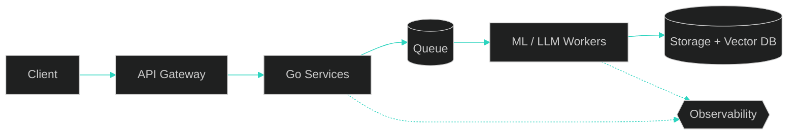

<div align="center">


<a href="https://git.io/typing-svg">
  
</a>

<br/>


<a href="https://www.linkedin.com/in/vaibhav-kumar-42b704276/"></a>
<a href="mailto:YOUR_EMAIL@example.com"></a>

</div>

<br/>

## `> about`

```yaml
name:      Vaibhav Kumar
role:      Backend & Distributed Systems Engineer
studying:  B.Tech CSE @ VIT Vellore
focus:     [Distributed Systems, LLM Infrastructure, Agentic AI, RAG]
building:  Distributed AI observability tooling
motto:     Ship systems that scale, then make them elegant.
```

<br/>

## `> system design, the way I see it`



<br/>

## `> stack`

<div align="center">


<br/>


</div>

<br/>

## `> projects`

<!-- Replace placeholders with your real repos -->

<table>
<tr>
<td width="50%" valign="top">

### [AI Observability Platform](https://github.com/v-aibha-v/REPO_NAME)
Tracing and metrics for LLM and agent pipelines: latency, token usage and failure paths across services.

`Go` `Python` `gRPC`

</td>
<td width="50%" valign="top">

### [RAG / Agent System](https://github.com/v-aibha-v/REPO_NAME)
Retrieval-augmented agent with tool use and an evaluation harness for reliable answers over private data.

`Python` `LLMs` `Vector DB`

</td>
</tr>
<tr>
<td width="50%" valign="top">

### [Backend / Systems Project](https://github.com/v-aibha-v/REPO_NAME)
One line of impact with a number, e.g. "10k req/s at p99 under 40 ms".

`C++` `Redis`

</td>
<td width="50%" valign="top">

### [Full-Stack App](https://github.com/v-aibha-v/REPO_NAME)
What it does and who it's for.

`TypeScript` `React`

</td>
</tr>
</table>

<br/>

## `> stats`

<div align="center">


</div>

<br/>

<div align="center">

*Working on distributed systems, LLM infra or developer tooling? Let's talk.*

</div>


